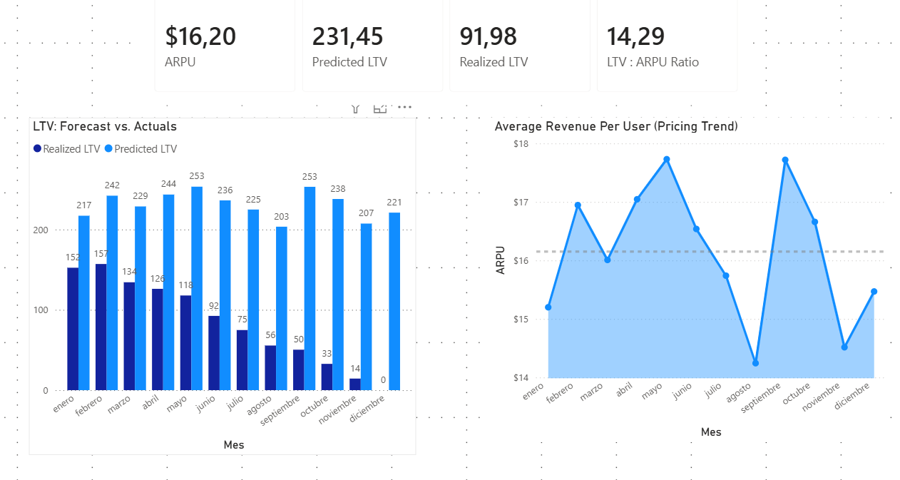

# 📊 TaskFlow Analytics - SaaS Product Intelligence

> **Role Simulation**: Head of Product Analytics @ TaskFlow (B2B SaaS)
> **Objective**: Analyze MRR stagnation, identify Churn drivers, and optimize the Free-to-Paid funnel.
> **Tools**: Python (Faker), Docker, PostgreSQL, Power BI (DAX).

---

## 📝 Executive Summary

TaskFlow, a B2B Project Management SaaS, has experienced flat MRR growth despite increasing traffic. This end-to-end data project was initiated to diagnose the root causes.

**Key Findings:**
1.  **Retention Crisis (March)**: A server outage in March caused a massive churn spike (12% vs 4% baseline), impacting Q2 revenue.
2.  **Localization Failure**: The Brazilian market (BR) shows **2x higher churn** than US/EU, suggesting pricing or translation failures.
3.  **Referral Goldmine**: Users acquired via "Referral" have a **$450 LTV** (vs $200 Organic). This is an under-utilized growth lever.

**Strategic Recommendations:**
*   🚀 **Launch "Referral 2.0"**: Incentivize user invites to double the high-LTV segment.
*   🇧🇷 **Fix Brazil**: Audit payment gateways and Portuguese translation immediately.
*   🛡️ **Win-back Campaign**: Target the "March Victims" with a discount offer.

---

## 🎨 Dashboard Gallery
*Visual proof of the engineered data pipeline.*

### 1. Executive Overview (The Pulse)

*High-level KPIs showing MRR, Active Subs, and the calculated Churn Rate.*

### 2. Growth & Acquisition

*Funnel analysis and geo-spatial risk assessment (spotting the Brazil issue).*

### 3. Financial Performance

*Realized vs Predicted LTV comparison and ARPU evolution.*

### 4. Retention & Cohorts

*Cohort Heatmap proving 12-month retention patterns and the 'March Incident'.*

### 5. Data Model (Star Schema)

*Professional Star Schema design with dedicated Measure Table.*

---

## 🔧 Technical Details

This project simulates a complete Data Engineering & Analytics pipeline:

### 1. Architecture


### 2. Data Engineering (SQL)
*   **Database**: PostgreSQL 15 running in Docker.
*   **Transformation**:
    *   **Logic**: Heavy lifting done in SQL (`analytics_master_view`) to reduce Power BI load.
    *   **Cohort Analysis**: Complex retention logic implemented via Window Functions in `cohort_retention_view`.

### 3. Analytics Engineering (Power BI)
*   **Modeling**: Star Schema with a dedicated *Date Table* and *Key Measures* table.
*   **Advanced DAX**:
    *   Time Intelligence for MRR Growth.
    *   `USERELATIONSHIP` to handle conflicting Active/Churn dates.
    *   Dynamic Parameters for LTV (Realized vs Predicted).

---

## 🚀 How to Run Locally

### 1. Prerequisites
*   Docker Desktop
*   Power BI Desktop (Windows)

### 2. Start the Data Warehouse
```bash
# 1. Generate data (if needed)
cd data_gen
python data_generator.py

# 2. Spin up the Database
cd ..
docker-compose up -d
```

### 3. Connect Power BI
*   Open `TaskFlow_Dashboard.pbix`.
*   If prompt appears:
    *   **Server**: `localhost`
    *   **Database**: `taskflow_db`
    *   **User/Pass**: `admin` / `password`

---

## 📂 Project Structure
```text
TaskFlow_Analytics/
├── data_gen/              # Python scripts for synthetic data (Faker)
├── sql/                   # Database logic
│   ├── init_db.sql        # DDL & Data Loading
│   └── queries/           # Analytical Views (Churn, Cohorts, LTV)
├── powerBi/               # Assets
│   └── screenshots/       # Dashboard images for this README
├── TaskFlow_Dashboard.pbix # The final Power BI file
└── docker-compose.yml     # Infrastructure code
```
