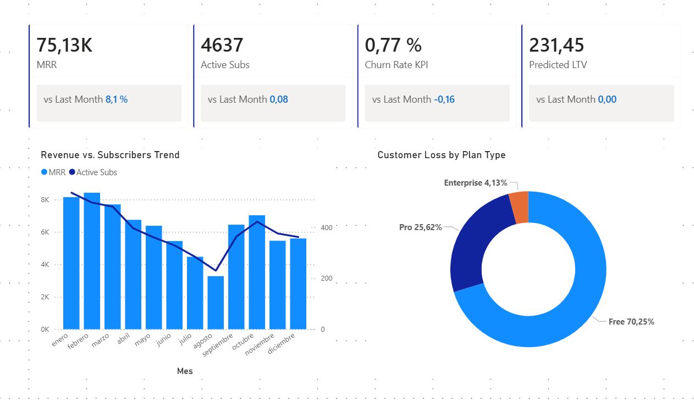
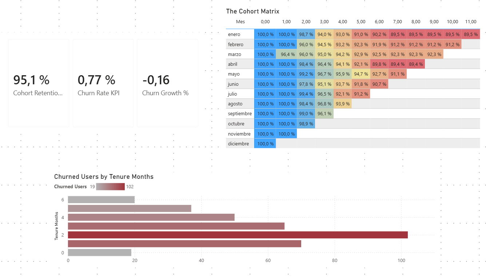

# 📊 TaskFlow Analytics - SaaS Product Intelligence

> **Role Simulation**: Head of Product Analytics @ TaskFlow (B2B SaaS) \
> **Objective**: Analyze MRR stagnation, identify Churn drivers, and optimize the Free-to-Paid funnel. \
> **Tools**: Python, Docker, PostgreSQL, Power BI.

[](https://www.youtube.com/watch?v=TU_ID_DE_VIDEO) \
*👆 Click above to watch the 3-minute analysis and strategic findings.*

---

## 📝 Executive Summary

**Key Findings (Visible in Dashboard):**

* **Strong Financial Health:** Current MRR is **$75.13K** (+8.1% MoM) with an excellent Monthly Churn Rate of **0.77%**.
* **The "Brazil Anomaly":** While Brazil is a top revenue driver, it suffers from a **1.61% Churn Rate** (3x higher than the US), indicating a pricing or localization misalignment.
* **Retained Revenue Gap:** There is a significant divergence between **Predicted LTV ($231)** and **Realized LTV ($92)**, sindicating that recent cohorts have not yet had sufficient time to mature. This is a common phenomenon in young companies where long-term value realization trails behind predictive modeling.

**Strategic Recommendations:**

1. **Stabilize the "Month 2 Cliff":** Data shows the highest customer drop-off occurs in the second month. Focusing Customer Success efforts on the Day 30-60 window could significantly improve LTV.
2. **Localize for LATAM:** Implementing PPP (Purchasing Power Parity) pricing for the Brazilian market could reduce the 1.61% churn rate and unlock sustainable growth in that region.
3. **Pro-Tier Retention:** While 70% of lost users are "Free", **25% are "Pro" users**. Reducing this specific churn segment yields the highest ROI.

---

## 🎨 Dashboard Gallery

*Visual proof of the engineered data pipeline.*

### 1. Executive Overview (The Pulse)


*High-level KPIs showing MRR, Active Subs, and the calculated Churn Rate.*

### 2. Growth & Acquisition


*Funnel analysis and geo-spatial risk assessment (spotting the Brazil issue).*

### 3. Financial Performance


*Realized vs Predicted LTV comparison and ARPU evolution.*

### 4. Retention & Cohorts


*Cohort Heatmap proving 12-month retention patterns and the 'March Incident'.*

### 5. Data Model (Star Schema)


*Professional Star Schema design with dedicated Measure Table.*

---

## 🔧 Technical Details

This project simulates a complete Data Engineering & Analytics pipeline:

### 1. Architecture


### 2. Data Engineering (SQL)

* **Database**: PostgreSQL 15 running in Docker.
* **Transformation**:
  * **Logic**: Heavy lifting done in SQL (`analytics_master_view`) to reduce Power BI load.
  * **Cohort Analysis**: Complex retention logic implemented via Window Functions in `cohort_retention_view`.

### 3. Analytics Engineering (Power BI)

* **Modeling**: Star Schema with a dedicated *Date Table* and *Key Measures* table.
* **Advanced DAX**:
  * Time Intelligence for MRR Growth.
  * `USERELATIONSHIP` to handle conflicting Active/Churn dates.
  * Dynamic Parameters for LTV (Realized vs Predicted).

---

## 🚀 How to Run Locally

### 1. Prerequisites

* Docker Desktop
* Power BI Desktop (Windows)

### 2. Start the Data Warehouse

```bash
# 1. Generate data (if needed)
cd data_gen
python data_generator.py

# 2. Spin up the Database
cd ..
docker-compose up -d
```

### 3. Connect Power BI

* Open `TaskFlow_Dashboard.pbix`.
* If prompt appears:
  * **Server**: `localhost`
  * **Database**: `taskflow_db`
  * **User/Pass**: `admin` / `password`

---

## 📂 Project Structure

```text
TaskFlow_Analytics/
├── data_gen/              # Python scripts for synthetic data (Faker)
├── sql/                   # Database logic
│   ├── init_db.sql        # DDL & Data Loading
│   └── queries/           # Analytical Views (Churn, Cohorts, LTV)
├── powerBi/               # Assets
│   └── screenshots/       # Dashboard images for this README
├── TaskFlow_Dashboard.pbix # The final Power BI file
└── docker-compose.yml     # Infrastructure code
```
